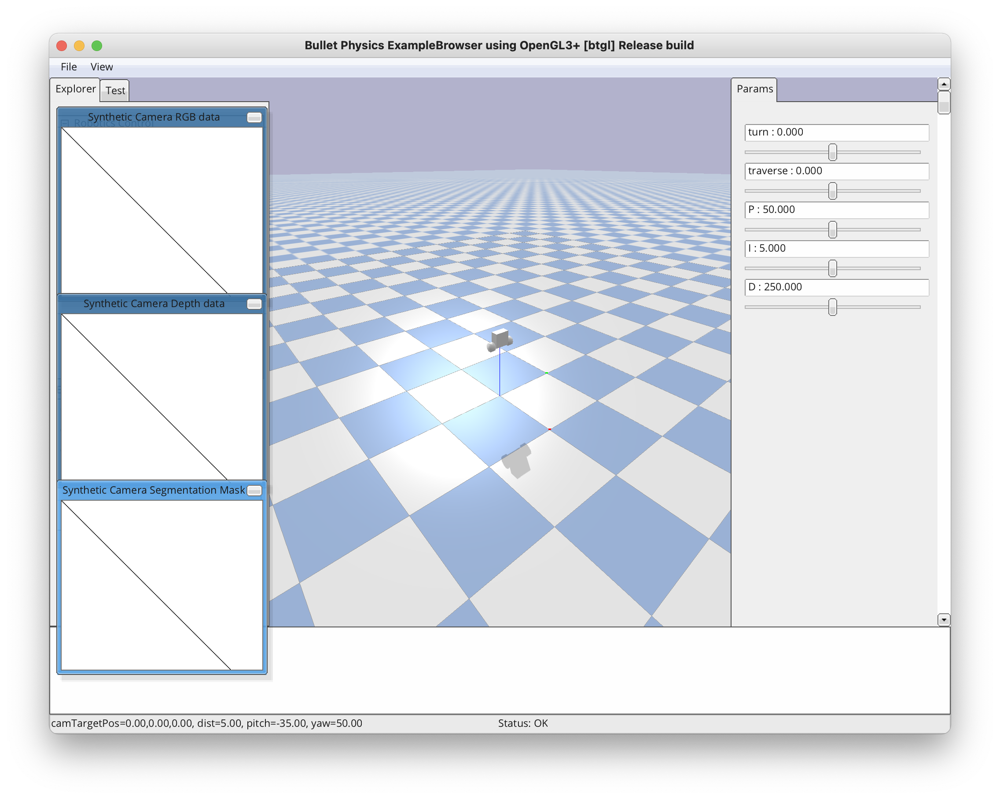

This project intends to serve as an example and exercise of how pybullet can serve to enable the development of ai-based control systems.

# Repository Setup
As always, start by cloning the repository and navigating to its top-level directory.

## Python Version
This project uses python 3. The following commands assume that your PATH is configured to use python 3 by default. If not, you may need to use `python3` instead of `python` in the following instructions. You can check python's version using `python -V`.

## Virtual Environment
It is recommended to use a virtual environment, but not strictly nessisary. To setup a virtual environment, follow these steps...
### Create Virtual Environment
The following command will create a virtual environment.
```
python -m venv venv
```
You should now see a folder named `venv` in the top level directory of the repository.

### Activate Virtual Environment
Now that the virtual environment has been created, we must "enter" it...
On Mac or Linux:
```
source venv/bin/activate
```
On Windows:
```
venv\Scripts\activate
```

## Install required packages
A complete list of all required packages can be found in `requirements.txt`. The following command will automatically install/upgrade/downgrade packages as needed such that they match the text file.
```
pip install -r requirements.txt
```

# Lightning Talk Demonstration
A simple demonstration has been put together to illustrate the basic features of pybullet. This code can be found in the `lightning-talk/` folder. To run the demo, simply run the following from the base directory.
```
python lightning-talk/demo.py
```

## PyBullet GUI
The PyBullet GUI provides a live view of the pybullet simulation and enables control of elements within the simulation. Robot control parameters can be set via the sliders on the right sidebar. These are listed in detail below.

**Parameters:**
- Turn: defines how quickly the robot should "spin"
- Traverse: defines how quickly the robot should drive forward/backward
- P: proportional gain
- I: integral gain
- D: derivative gain

**Controls:**
- scroll: zoom in/out
- ctrl + click-and-drag: orbit
- click-and-drag on robot: "pull" on robot

A screenshot of the PyBullet GUI can be seen below...


## Matplotlib Graph
A matplotlib graph window will also open and displays live data. Data points are recorded every simulation step and only the most recent 100 data points are saved and displayed at any given time. An example of what this window looks like can be seen below...


# Final Demonstration
The final project extended the demonstration from the lightning talk, replacing the two-wheeled robot with an inverted pendulum and adding a second axis to balance about.

The resulting python script can be run with the following command.
```
python final-project/PID\ Control.py
```
The sliders on the right bar have been changed to contain the following parameters.

**Parameters: (independent instance of each for x and y axes)**
- Force on axis: A force applied on the platform in the x-axis to maintain the offset angle applied to the pole.
- P: Proportional gain
- I: Integral gain
- D: Derivative gain 


A screenshot of the PyBullet GUI can be seen below...


## Future Work
There is a lot of room for improvement in this project. The first recommended improvement would be to add PID control loops to maintain the position of the cart/pole on the x/y plane.
