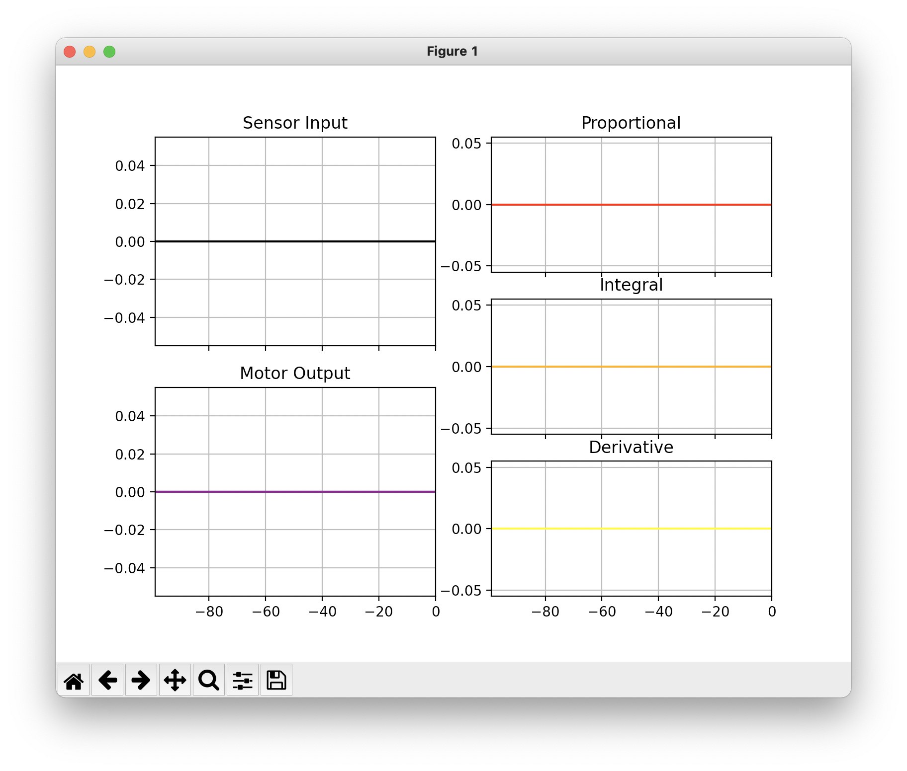

This project intends to serve as an example and exercise of how pybullet can serve to enable the development of ai-based control systems.

# Repository Setup
As always, start by cloning the repository and navigating to its top-level directory.

## Python Version
This project uses python 3. The following commands assume that your PATH is configured to use python 3 by default. If not, you may need to use `python3` instead of `python` in the following instructions. You can check python's version using `python -V`.

## Virtual Environment
It is recommended to use a virtual environment, but not strictly nessisary. To setup a virtual environment, follow these steps...
### Create Virtual Environment
The following command will create a virtual environment.
```
python -m venv venv
```
You should now see a folder named `venv` in the top level directory of the repository.

### Activate Virtual Environment
Now that the virtual environment has been created, we must "enter" it...
On Mac or Linux:
```
source venv/bin/activate
```
On Windows:
```
venv\Scripts\activate
```

## Install required packages
A complete list of all required packages can be found in `requirements.txt`. The following command will automatically install/upgrade/downgrade packages as needed such that they match the text file.
```
pip install -r requirements.txt
```

# Demo
A simple demonstration has been put together to illustrate the basic features of pybullet. This code can be found in the `lightning-talk/` folder. To run the demo, simply run `python lightning-talk/demo.py` from the base directoy.

## PyBullet GUI
The PyBullet GUI provides a live view of the pybullet simulation and enables control of elements within the simulation. Most notibly, the speed of the two wheels of the simple demo bot can be set using the corrosponding sliders on the right.

**Controls:**
- scroll: zoom in/out
- ctrl + click-and-drag: orbit
- click-and-drag on robot: "pull" on robot

A screenshot of the PyBullet GUI can be seen below...


## Matplotlib Graph
A matplotlib graph window will also open and displays live pitch data. Data points are recorded every 5 simulation steps and only the most recent 25 recorded data points are displayed at any given time. An example of what this window looks like can be seen below...

